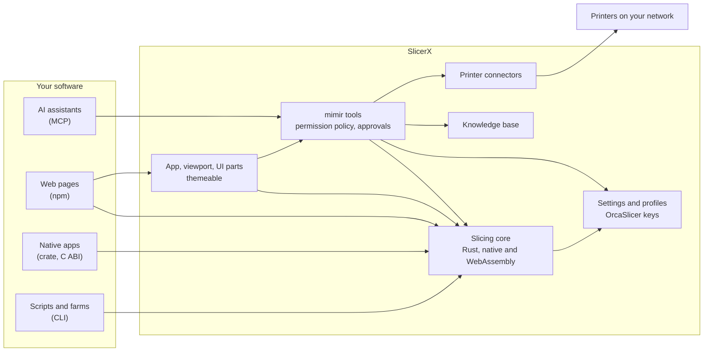

<p align="center">
  <picture>
    <source media="(prefers-color-scheme: dark)" srcset="docs/readme-assets/banner-dark.svg">
    <source media="(prefers-color-scheme: light)" srcset="docs/readme-assets/banner-light.svg">
    
  </picture>
</p>

<p align="center">
  <a href="docs/licensing.md"></a>
  <a href="https://github.com/slicerx-oss/slicerx/actions/workflows/ci.yml"></a>
  <!-- Add https://img.shields.io/npm/v/@slicerx/slicer and https://img.shields.io/crates/v/sx-core once the packages are published. -->
</p>

<h3 align="center">A Rust-based open source slicer for builders and makers.</h3>
<p align="center"><b>The AI-ready slicer</b></p>

SlicerX is a free, fully open source slicer for FFF 3D printers, built to be driven by other software as much as by people. An AI assistant can plan settings, slice, and send a job to a printer through its MCP server, under a permission policy the user controls. A web page can slice in the browser with the WebAssembly core, and a print farm tool can call the CLI or link the Rust crate. The slicing core is written in Rust, compiles to native code and WebAssembly, and uses the setting names OrcaSlicer, Bambu Studio and PrusaSlicer share, so existing profiles carry over. It contains no code from those projects. The base kit is Apache-2.0, so you can build it into your own product, open or closed, as long as you keep the "Made possible by SlicerX" credit.

<p align="center">
  
</p>

> [!NOTE]
> SlicerX is pre-alpha. The engine continues work its author began in 2021; this app and repository started in September 2026, and several surfaces below are still being built. [Project status](#project-status) says what runs today.

## The base kit

Everything below is the base kit, under Apache-2.0: what you need to slice, set up and drive printers from your own software.

| Surface | What you get | State |
| --- | --- | --- |
| [MCP server](packages/mcp/README.md) `@slicerx/mcp` | mimir's tools for any MCP client: slice, estimate, plan and check settings, orient, cut, split, repair, hollow, emboss, calibration models, resume plan, arrange, queue, printer control, knowledge base and docs as resources | `npx @slicerx/mcp` |
| [npm package](docs/embedding.md#npm-package) `@slicerx/slicer` | The WebAssembly core in a Web Worker pool, for slicing in the browser | `npm install @slicerx/slicer` |
| [CLI](docs/embedding.md#cli) `sx` | Model and settings in, G-code and a preview buffer out, as a separate process | [Engine release](https://github.com/slicerx-oss/slicerx/releases) (with `sx-geom` and `sx-link`) |
| [Rust crate](docs/embedding.md#rust-crate) `sx-core` | The slicing core as a library, with no file system, network or async runtime inside | `cargo add sx-core` |
| [C ABI](docs/embedding.md#c-abi) `libslicerx` | JSON in, G-code and preview bytes out, for C, C++, Swift, C# or Go | [Engine release](https://github.com/slicerx-oss/slicerx/releases) (library and header) |
| [Viewport and UI parts](docs/embedding.md#viewport) | The three.js plate and toolpath viewport, and the settings panel as React components or custom elements | `npm install @slicerx/viewport` or `@slicerx/embed` |
| [Theming](docs/embedding.md#theming-and-branding) | Your colors, fonts, gradient, logo, icons, and the 3D viewport's scene colors | Working |
| [Printer connectors](packages/connect/docs/README.md) | Bambu Lab LAN, Klipper through Moonraker, Creality, Snapmaker, PrusaLink, OctoPrint, Duet, Elegoo, plus Spoolman and Home Assistant | In progress |

Settings everywhere use the shared slicer key names, so existing profiles and knowledge carry over. To ship a full product of your own on top of the base kit (your brand, features, printers and AI provider, set in one configuration file), start with the [integrator quickstart](docs/quickstart.md), then [docs/integrating.md](docs/integrating.md).

## mimir and the MCP server

mimir is the assistant built into SlicerX. It plans multi-step jobs (pick printers with the right filament, arrange plates, adjust settings for a material, slice, queue) and cites the knowledge base for every setting it changes.

mimir runs on a model you choose: sign in with your ChatGPT plan, paste your own OpenAI or Anthropic API key, or point it at a local model through Ollama or LM Studio. Keys stay in your operating system's keychain and go only to the provider they belong to.

The MCP server gives other AI tools the same tools and the same rules:

- Reading is always allowed: settings, profiles, the knowledge base, printer status and camera snapshots.
- Everything else follows a permission policy the user writes: Allow, Ask first or Off for each class of action (changing the project, queueing jobs, heating or moving a printer, writing saved profiles, spending money). Heating, moving and queueing default to Ask first, and purchases default to Off.
- Ask first asks the user directly through MCP elicitation when the client supports it. Otherwise the tool returns an approval request, and the client has to confirm it before anything happens.
- Each approval covers one action on one target with the exact parameters shown, is signed, works once and expires after five minutes. The printer connector checks it before sending a byte.
- Every call and decision goes to an action log.

```sh
claude mcp add slicerx -- npx -y @slicerx/mcp --allow-dir ~/prints
```

That registers the server with Claude Code. [packages/mcp/README.md](packages/mcp/README.md) covers Claude Desktop, Cursor, ChatGPT and other clients, streamable HTTP, the policy file and the full tool list.

Claude Code users can also install the SlicerX plugin, which bundles the server with skills for slicing, settings, diagnosis, calibration, printer setup and theming, plus slash commands:

```
/plugin marketplace add slicerx-oss/slicerx
/plugin install slicerx@slicerx
```

See [packages/claude-plugin](packages/claude-plugin/README.md).

## Features

Working today:

- A native slicing core (`sx-core`) with contour slicing, three wall generators (classic, Arachne and aegis, our own variable-width walls and the default), rectilinear, grid, gyroid and other infill patterns, tree and normal supports, top and bottom shells, brim, raft, seam placement, fuzzy skin, multi-material with tool changes and the atlas prime tower, G-code for Marlin 2, Klipper and RepRapFirmware, and a packed preview buffer (SXPV). It reads STL, OBJ, AMF and Bambu Lab or OrcaSlicer 3MF projects. It slices the 508 layer reference plate in 17.1 ms (median of 15 runs on an 11 core Apple M3 Pro), and every benchmark run also checks that the G-code is valid and that sharded and unsharded runs match byte for byte.
- sleipnir, adaptive layer height: thin layers on curves and slopes, thick layers on straight walls, listed after the fixed layer heights.
- The same core in the browser: a WebAssembly worker pool slices the reference plate in 55.3 ms (median first slice in Chrome), with G-code identical to the native build.
- The `sx` command line tool: slice a file or a JSON request, print the JSON schemas, and run the benchmark.
- The C ABI (`libslicerx` and `slicerx.h`), tested by a C program that slices the reference plate.
- More than 700 settings with type, unit, limits and the slicing stage each one invalidates, with help text and a tier (simple, advanced, expert) for each; profile import with `inherits`; settings plans for a new material, printer or nozzle; validation and conflict checks; and Easy mode (detail, strength, speed, supports, brim) mapped onto those keys. Printer, filament and process presets ship with the app.
- A print knowledge base with cited sources: filaments, printers and accessories, troubleshooting guides and workflow guides.
- The MCP server with mimir's tools, the sx-geom mesh tools (cut, split, orient, repair, hollow, emboss, calibration models and a resume plan for a failed print), the permission policy, approvals and action log described above, and a Claude Code plugin built on it.
- The embeddable viewport and settings panel, as React components and custom elements.
- The browser app: Prepare, Preview, Library, Printers (with simulated printers) and mimir. It slices automatically after each edit (switch it off under Settings, Slicing), and Print opens the Print sheet: the file, the printer, the preflight result and your choices, with your confirm click as the approval.
- Calibration by need: the app picks the tests a new spool, printer or nozzle needs (flow, pressure advance, temperature, retraction and more), puts them on one plate, and saves the picked values to a filament preset for that spool, printer and nozzle.
- CAD tools in the app: STEP import, sketches with typed sizes extruded into solids, push and pull on a face, fillet and chamfer, dimensions that stay on the model, an SVG outline on a face, and an editable history of steps for each object.
- norn: edit from Preview. Change a setting or move a layer mark and see the old and new toolpaths together before you slice again.

In progress, working in tests and not yet proven on real hardware:

- Print watch: a local detector (SigLIP2 plus frame-change signals, run on your machine) looks at the printer camera during a print. Three suspicious frames out of five send a push with no image content. Auto-pause is off by default per printer and needs mimir's confirmation of one frame. Ask mimir "how is my print going?" for a fresh capture and its reading. The model file ships beside the `sx-watch` binary.
- Connect your AI agent: Settings, mimir, with one-click setup of the SlicerX MCP server and skills for Claude Desktop, Claude Code, ChatGPT, Codex and Cursor, each with its own agent code. An agent can watch, slice and queue. Only a person starts a print.
- Remote access: a self-hosted relay, not deployed. The code and the phone pairing (QR code, no account needed) exist and are tested against mock printers. Nothing runs on a public server today, and you would host the relay yourself. The relay carries sealed bytes (WebRTC between your phone and your computer, with a 1 fps fallback).
- Printer connectors against real hardware, and the desktop app (runs on macOS; Windows and Linux builds are set up in CI and not yet proven). Printer setup guides for each supported printer are in [packages/connect/docs](packages/connect/docs/README.md).

Planned: a free, moderated model library that anyone can upload to, with creator pages that link out to their own sites, published npm and crates.io packages, mobile apps and hosted cloud slicing.

## Quick start

You need Node 24 or newer, pnpm 10 and Rust 1.98.1. In a fresh clone:

```sh
pnpm install
cargo build -p sx-cli --release
```

Slice from the command line:

```sh
target/release/sx slice packages/core/bench/models/x-mark.stl --config config.json -o x-mark.gcode
```

`config.json` holds OrcaSlicer keys, for example `{"layer_height": 0.2, "wall_loops": 3, "sparse_infill_density": 20}`.

Run the browser app on http://localhost:5173:

```sh
pnpm dev
```

The browser app slices on the WebAssembly worker pool. [docs/install.md](docs/install.md) covers every surface, including the Rust crate, the npm package and the desktop app, and links the printer setup guides.

## How it fits together



The core takes bytes and returns bytes, which is why the same code runs natively, in WebAssembly and behind every surface above. Printer traffic stays on your network: connectors talk to printers directly, and credentials stay in the operating system keychain.

## For people who print

The SlicerX app, working in the browser and running on macOS as a desktop app so far, is built from the same base kit: Prepare, Preview, Library, Printers and mimir in one window with a command bar. It slices as you edit, sends a print through the Print sheet, picks calibration tests by what your spool and printer need, and can watch a print through the printer camera (in progress). The SlicerX edition, layered on top of the base kit, holds the code for accounts, cloud slicing and the free model library with creator pages. None of those services is hosted yet. All of it is open source and free to use. The base kit builds and runs without the edition.

## Project status

| Surface | State |
| --- | --- |
| Slicing core and `sx` CLI | Working: STL and 3MF, classic, Arachne and aegis walls, infill, supports, shells, brim, raft, seams, multi-material, G-code, preview buffer, JSON requests |
| WebAssembly worker pool | Working in Chrome; npm package not yet published |
| C ABI | Working; not yet published |
| Settings, profiles and knowledge base | Working |
| MCP server and Claude Code plugin | Working with simulated printers; real printers through `sx-link` as the connectors land |
| Browser app, viewport and embeddable UI | Working |
| Printer connectors | In progress; tested against mock printers, not yet on hardware |
| Print watch | In progress; detector and push built, not yet tested on a real printer |
| Connect your AI agent | In progress; install mechanics and panel built |
| Remote access | Self-hosted relay, not deployed; phone pairing built |
| Phone app | In progress |
| Desktop app | In progress; runs on macOS, Windows and Linux builds not yet proven |
| Theming | UI and viewport theming working |
| Open `.sx3mf` container format | Working |

## Support development

SlicerX is free and there is nothing to buy. If it saves you time, you can support the work: sponsor on [GitHub Sponsors](https://github.com/sponsors/Subydev), [buy the maintainers a coffee](https://buymeacoffee.com/xccyf47w7r), or pay what you want at [slicerx.app/support](https://slicerx.app/support). Donations do not buy features or priority. Code, bug reports and printer profiles help just as much.

## Contributing

Bug reports, printer profiles, connectors, translations, docs and code are welcome. [CONTRIBUTING.md](CONTRIBUTING.md) explains how to propose a change, how to sign off commits (Developer Certificate of Origin) and how we name commits and pull requests (Conventional Commits). Report security problems privately as described in [SECURITY.md](SECURITY.md). Participation is covered by the [Code of Conduct](CODE_OF_CONDUCT.md).

## License and credits

SlicerX is licensed under the [Apache License 2.0](LICENSE-APACHE). That covers everything the SlicerX contributors wrote: the engine, the CLI, the C ABI, the settings package, the MCP server, the apps, the UI parts, the printer connectors and the SlicerX edition. You can embed any of it in software under any license, closed source included. The one condition is credit: pass on the [NOTICE](NOTICE) and show "Made possible by SlicerX" wherever your product lists third-party credits.

The stock printer, filament and process profiles in [packages/profiles](packages/profiles) come from the profile resources of OrcaSlicer and Bambu Studio, and they stay under the GNU Affero General Public License v3.0 or later. The engine, the CLI and the C ABI do not use them. The SlicerX app ships them, so the app as distributed is covered by the AGPL as a whole. [docs/licensing.md](docs/licensing.md) explains which files carry which license and what that means for your build.

SlicerX contains no code or help text from OrcaSlicer, Bambu Studio, PrusaSlicer or Slic3r. We read their documented behavior and their file formats, and write our own implementation. Their setting names are the shared vocabulary, so OrcaSlicer, Bambu Studio and PrusaSlicer profile and project files import. The only data taken from them is the stock profiles above. The aegis wall generator follows the method of preFlight's Athena walls, with thanks to its authors. [NOTICE](NOTICE) and [THIRD-PARTY.md](THIRD-PARTY.md) list the libraries, model weights and fonts that do ship.

## Trademark

The code is open source. The SlicerX name, the logo and the Nocturne theme artwork are reserved, and none of the licenses grants rights in them. You are free to fork the code; a fork distributed with changes needs its own name and logo. Bambu Lab, Prusa, Creality, Elegoo, Klipper and other product names belong to their owners and appear here only to describe compatibility.
