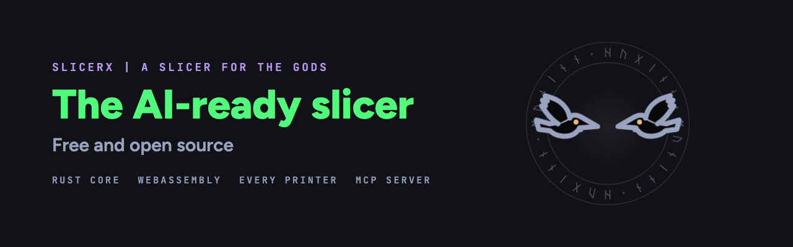
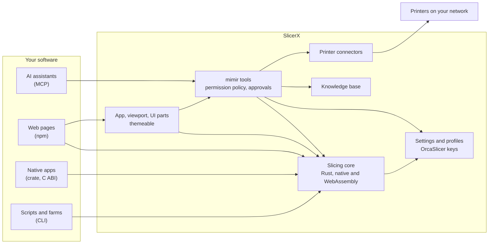

<p align="center">
  <picture>
    <source media="(prefers-reduced-motion: reduce)" srcset="docs/readme-assets/banner.png">
    
  </picture>
</p>

<p align="center">
  <a href="docs/licensing.md"></a>
  <a href="https://github.com/slicerx-oss/slicerx/actions/workflows/ci.yml"></a>
  <!-- Add https://img.shields.io/npm/v/@slicerx/slicer and https://img.shields.io/crates/v/sx-core once the packages are published. -->
</p>

<h3 align="center">An open source CAD engine and slicer on a hand-written Rust core, for builders and makers.</h3>
<p align="center"><b>The AI-ready slicer</b></p>

SlicerX is a free, fully open source CAD engine and slicer for FFF 3D printers, built to be driven by other software as much as by people. An AI assistant can plan settings, slice, and send a job to a printer through its MCP server, under a permission policy the user controls. A web page can slice in the browser with the WebAssembly core, and a print farm tool can call the CLI or link the Rust crate. The slicing core is hand-written Rust, compiles to native code and WebAssembly, and uses the setting names OrcaSlicer, Bambu Studio and PrusaSlicer share, so existing profiles carry over. It contains no code from those projects. The base kit is Apache-2.0, so you can build it into your own product, open or closed, as long as you keep the "Made possible by SlicerX" credit.

<p align="center">
  <picture>
    <source media="(prefers-color-scheme: dark)" srcset="docs/readme-assets/slicerx-title-clear.png">
    
  </picture>
</p>

> [!NOTE]
> SlicerX is pre-alpha and started in September 2026. It borrows a few ideas from a small slicing prototype its author wrote in 2021; nearly all of today's code is new. Several surfaces below are still being built.

## The base kit

Everything below is the base kit, under Apache-2.0: what you need to slice, set up and drive printers from your own software.

| Surface | What you get | State |
| --- | --- | --- |
| [MCP server](packages/mcp/README.md) `@slicerx/mcp` | mimir's tools for any MCP client: slice, estimate, plan and check settings, orient, cut, split, repair, hollow, emboss, calibration models, resume plan, arrange, queue, printer control, knowledge base and docs as resources | `npx @slicerx/mcp` |
| [npm package](docs/embedding.md#npm-package) `@slicerx/slicer` | The WebAssembly core in a Web Worker pool, for slicing in the browser | `npm install @slicerx/slicer` |
| [CLI](docs/embedding.md#cli) `sx` | Model and settings in, G-code and a preview buffer out, as a separate process | [Engine release](https://github.com/slicerx-oss/slicerx/releases) (with `sx-geom` and `sx-link`) |
| [Rust crate](docs/embedding.md#rust-crate) `sx-core` | The slicing core as a library, with no file system, network or async runtime inside | `cargo add sx-core` |
| [C ABI](docs/embedding.md#c-abi) `libslicerx` | JSON in, G-code and preview bytes out, for C, C++, Swift, C# or Go | [Engine release](https://github.com/slicerx-oss/slicerx/releases) (library and header) |
| [Viewport and UI parts](docs/embedding.md#viewport) | The three.js plate and toolpath viewport, and the settings panel as React components or custom elements | `npm install @slicerx/viewport` or `@slicerx/embed` |
| [Theming](docs/embedding.md#theming-and-branding) | Your colors, fonts, gradient, logo, icons, and the 3D viewport's scene colors | Working |
| [Printer connectors](packages/connect/docs/README.md) | Bambu Lab LAN, Klipper through Moonraker, Creality, Snapmaker, PrusaLink, OctoPrint, Duet, Elegoo, plus Spoolman and Home Assistant | In progress |

Settings everywhere use the shared slicer key names, so existing profiles and knowledge carry over. To ship a full product of your own on top of the base kit (your brand, features, printers and AI provider, set in one configuration file), start with the [integrator quickstart](docs/quickstart.md), then [docs/integrating.md](docs/integrating.md).

## mimir and the MCP server

mimir is the assistant built into SlicerX. It plans jobs (printers, plates, settings, slicing, the queue) and cites the knowledge base for every setting it changes. It runs on the model you choose: your ChatGPT plan, an OpenAI or Anthropic key, or a local model through Ollama, LM Studio and similar. Keys stay in your system keychain.

The MCP server gives other AI tools the same tools under your rules. Reading is always allowed. Changing a project, queueing, heating or moving a printer, and spending money follow a policy you set (Allow, Ask first or Off), and each approval is signed, single-use and logged.

```sh
claude mcp add slicerx -- npx -y @slicerx/mcp --allow-dir ~/prints
```

Other clients, the policy file and the tool list are in [packages/mcp/README.md](packages/mcp/README.md). Claude Code users can also install the [SlicerX plugin](packages/claude-plugin/README.md) with `/plugin marketplace add slicerx-oss/slicerx`.

## The gods

Each name marks something SlicerX does its own way, or better than the slicers it learned from.

| | |
|---|---|
| **mimir** | The assistant. It answers questions, reads your printer's camera, and suggests fixes you approve. |
| **huginn and muninn** | mimir's two model tiers: huginn takes a quick look, muninn thinks deep. huginn also watches the printer's camera and pauses the print when a hand reaches in. |
| **aegis** | Variable-width walls, the default. Thin features print solid, with far fewer width changes than Arachne. |
| **sleipnir** | Adaptive layer height: thin layers on curves and slopes, thick on straight walls. |
| **atlas** | A prime tower that places and sizes itself. |
| **norn** | Edit from Preview: click a toolpath, change the setting behind it, and see before and after. |
| **heimdall** | Preview playback that runs the print as the machine will, and stops where the head or gantry would hit a part. |

## Quick start

You need Node 24 or newer, pnpm 10 and Rust 1.98.1. In a fresh clone:

```sh
pnpm install
cargo build -p sx-cli --release
```

Slice from the command line:

```sh
target/release/sx slice packages/core/bench/models/x-mark.stl --config config.json -o x-mark.gcode
```

`config.json` holds OrcaSlicer keys, for example `{"layer_height": 0.2, "wall_loops": 3, "sparse_infill_density": 20}`.

Run the browser app on http://localhost:5173:

```sh
pnpm dev
```

The browser app slices on the WebAssembly worker pool. [docs/install.md](docs/install.md) covers every surface, including the Rust crate, the npm package and the desktop app, and links the printer setup guides.

## How it fits together



The core takes bytes and returns bytes, which is why the same code runs natively, in WebAssembly and behind every surface above. Printer traffic stays on your network: connectors talk to printers directly, and credentials stay in the operating system keychain.

## For people who print

The SlicerX app, working in the browser and running on macOS as a desktop app so far, is built from the same base kit: Prepare, Preview, Library, Printers and mimir in one window with a command bar. It slices as you edit, sends a print through the Print sheet, picks calibration tests by what your spool and printer need, and can watch a print through the printer camera (in progress). The SlicerX edition, layered on top of the base kit, holds the code for accounts, cloud slicing and the free model library with creator pages. None of those services is hosted yet. All of it is open source and free to use. The base kit builds and runs without the edition.

<p align="center">
  <a href="docs/integrators/credit-kit">
    <picture>
      <source media="(prefers-color-scheme: light)" srcset="docs/integrators/credit-kit/badges/made-possible-by-slicerx-medium-light.svg">
      
    </picture>
  </a>
</p>

<p align="center">
  <a href="https://suby.dev"></a>
  <a href="https://buymeacoffee.com/xccyf47w7r"></a>
</p>
