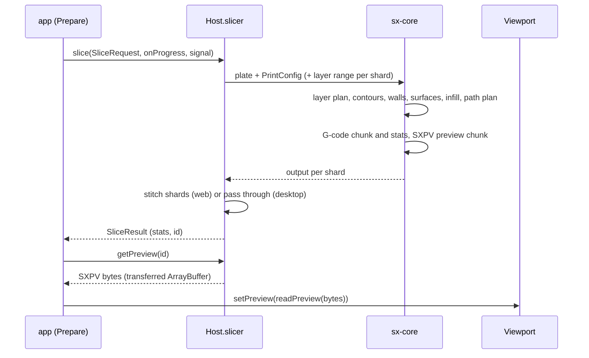

# SlicerX architecture

How the pieces of SlicerX fit together. Each package README has the details of its own API.

## Overview

- One React application (`packages/app`) runs in the browser build (`apps/web`) and in the Tauri 2 desktop app (`apps/desktop`). It talks only to a `Host` interface (`packages/contracts/src/host.ts`). Each app supplies its own `Host`; nothing else differs.
- The slicing engine is a Rust crate, `sx-core` (`packages/core`). It takes bytes and returns bytes, with no file system, network or async runtime inside, so the same code compiles natively (desktop, CLI, C ABI) and to `wasm32-unknown-unknown` (browser).
- In the browser, a pool of Web Workers each runs its own WebAssembly instance and slices a range of layers. Sharded and unsharded runs give the same G-code and preview bytes.
- Preview data crosses every boundary as one packed binary format, SXPV (below). The viewport (`packages/ui/viewport`, three.js, React-free) draws it with GPU instancing and scrubs layers by changing the instance range.
- mimir's agent loop is TypeScript (`packages/pilot`), so the browser, the desktop app and the evals share it. The API key never enters the webview: model requests go through a host transport (`packages/pilot/llm`, Rust) that adds the key from the OS keychain or the environment.
- Printer connectors are Rust (`packages/connect`), because a browser cannot open MQTT over TLS or reach LAN HTTP from an https page. The desktop app links them directly; browser users run `sx-link`, a small localhost bridge built from the same crate.
- Side effects outside the project (a printer, a saved profile, money) need a single-use approval token that the host mints after a person approves (`packages/pilot/permit`). The model has no way to mint one, and the check runs in Rust, below the agent loop.
- Settings use the key names OrcaSlicer, Bambu Studio and PrusaSlicer share. Easy mode is a declarative mapping table that Rust and TypeScript both read, checked by a shared fixture file.

## Repository layout

| Path | What it is |
| --- | --- |
| `packages/core` | `sx-core`, plus `wasm/` (the browser module), `web/` (`@slicerx/slicer`, the worker pool), `cli/` (`sx`), `ffi/` (`libslicerx` and `slicerx.h`) and `bench/` |
| `packages/geom` | `sx-geom`: mesh operations (cut, split, repair, orient, hollow, emboss, calibration models, resume plans) and the CAD tools |
| `packages/settings` | Settings schema, Easy mode and profile import, in Rust and TypeScript over one set of data files |
| `packages/profiles` | Stock printer, filament and process profile data (AGPL-3.0-or-later, see below) |
| `packages/contracts` | Every type that crosses a package boundary, the SXPV constants and `readPreview()` |
| `packages/app` | The application shared by the browser and desktop builds |
| `packages/ui`, `packages/ui/viewport`, `packages/embed` | Tokens, icons and primitives; the 3D viewport; the viewport and settings panel as React components and custom elements |
| `packages/pilot` | mimir: the agent runtime, tools, skills, knowledge tools, the model transport (`llm/`) and the approval broker (`permit/`) |
| `packages/mcp`, `packages/claude-plugin` | The MCP server on mimir's tool registry, and the Claude Code plugin built on it |
| `packages/connect` | Printer and service connectors, `sx-link`, the pairing relay and mock printers |
| `packages/pair` | Phone pairing and the sealed channel between a phone and a computer |
| `packages/watch` | The print watch's local failure detector |
| `packages/store`, `packages/sx3mf` | Sign-in and model library client; the open `.sx3mf` project format |
| `packages/edition-config` | The typed configuration every edition surface reads |
| `knowledge/` | The print knowledge base with cited sources |
| `apps/web`, `apps/desktop` | The browser and desktop builds |
| `editions/slicerx` | The SlicerX edition: cloud, phone app and brand |

## Base and edition

SlicerX is two layers in one repository. The base kit is what other apps take: the engine with its WASM, CLI and C ABI surfaces, settings, the knowledge base, the viewport and UI kit, connectors and `sx-link`, the mimir runtime, the MCP server and the embeddable components. The edition (`editions/slicerx`) is the SlicerX product built on the base the way a downstream fork would be: accounts and cloud slicing, the model library, the phone app and the brand. The base builds, tests and runs with the edition deleted. Every edition surface reads one typed configuration, `@slicerx/edition-config`, so a fork rebrands and reconfigures without editing code ([integrating.md](integrating.md)).

Everything the SlicerX contributors wrote, base and edition alike, is Apache-2.0 with the NOTICE and its "Made possible by SlicerX" credit. The stock profile data in `packages/profiles` comes from OrcaSlicer and Bambu Studio and stays AGPL-3.0-or-later; the engine, the CLI and the C ABI do not use it. [licensing.md](licensing.md) has the details.

## Units and coordinates

- Millimeters in every public API, as `f32` for mesh and preview data and `f64` for settings.
- Inside `sx-core`, 2D geometry uses `i32` integer coordinates with one unit = 0.1 micrometer (1e-4 mm), so a 256 mm bed spans 2,560,000 units and products fit in `i64`.
- Z is up and the plate origin is the bed's front left corner. Objects carry a transform; parts are already in object space.
- The viewport converts to three.js Y-up with `(x, y, z) -> (x, z, -y)`.

## Slice data flow



A `SliceRequest` (`packages/contracts/src/slice.ts`, JSON Schema from `sx schema request`) holds the plate, the resolved settings and the options. Every settings key declares the first stage it invalidates (`invalidates` in the settings schema).

`slice_range(plate, config, layers, halo)` slices a range of layers and reads `halo` layers on each side, so top and bottom detection matches a full run. A rule that reads further than the halo (an internal bridge looks down through every layer of its bridge cluster, however many) gets that layer cut on demand, once per range, so no rule ever sees a missing neighbor and the session's caches never keep a value worked out from one. The G-code uses relative extrusion, so chunks concatenate without rewriting E values, and the web host offsets the preview's layer tables when it stitches them. Tests check that different shard counts give identical G-code and SXPV bytes, and the output never depends on the wall clock or on randomness.

## SXPV preview buffer format

One little-endian binary blob. `packages/contracts/src/preview.ts` has the constants and `readPreview()`; Rust writes it in `sx-core::preview`.

```
header (32 bytes)
  0  u32  magic "SXPV" (0x56505853 read as little-endian u32)
  4  u16  version = 1
  6  u16  flags (bit 0: has travels, bit 1: has extras, bit 2: has objects)
  8  u32  segment count S
  12 u32  layer count N
  16 u32  travel count T
  20 u32  tool count
  24 f32  nominal layer height (mm)
  28 u32  reserved
layer tables
  u32[N+1] first segment index of each layer (last entry = S)
  f32[N]   layer top z (mm)
  f32[N]   layer print time (s)
  u32[N+1] first travel index of each layer (only when flags bit 0 is set)
segments, S records of 32 bytes, print order within each layer
  0  f32 x0   4  f32 y0   8  f32 x1   12 f32 y1   16 f32 z (top of bead)
  20 u16 width (micrometers)   22 u16 height (micrometers)
  24 u8  feature   25 u8 tool   26 u16 speed (0.1 mm/s)
  28 f32 volumetric flow (mm3/s)
travels, T records of 16 bytes: f32 x0, y0, x1, y1 (z from the layer table), in print order
extras (only when flags bit 1 is set; needs travels), S records of 8 bytes in segment order, then T bytes, then zero padding to 4 bytes
  0  u8 fan (0 to 255)   1  u8 flags (1 retract before this path, 2 lift, 4 seam: start of a closed wall loop, 8 path start; set on the
     first segment of a path)   2  u16 nozzle temperature (C)   4  u32 G-code line (1-based in the file written, 0 when unknown)
  travel bytes: bit 0 retracted, bit 1 lifted for that travel
objects (only when flags bit 2 is set; plates of two or more objects), S u16 in segment order, then zero padding to 4 bytes
  the index of the segment's object in the request's plate.objects; 0xFFFF for the skirt, a brim shared by several objects,
  the prime tower and custom G-code
```

New blocks go behind the existing ones under a new flag bit, so readers that do not know a flag still read the rest; the version changes only when an existing block changes.

Feature ids: 0 outer wall, 1 inner wall, 2 overhang wall, 3 top surface, 4 bottom surface, 5 internal solid, 6 sparse infill, 7 bridge, 8 support, 9 support interface, 10 brim or skirt, 11 ironing, 12 gap fill, 13 prime tower, 14 custom. Every table and record is 4-byte aligned, and the 32-byte stride suits GPU vertex fetch.

## Embedding surfaces

Other software can use SlicerX through the `sx-core` crate, the `@slicerx/slicer` npm package, the `sx` CLI, the C ABI (`libslicerx`), the `@slicerx/embed` UI pieces and the `@slicerx/mcp` server. Each is versioned on its own and has a `CHANGELOG.md` next to it. The request JSON and SXPV carry their own version numbers, and readers reject versions they do not know. [embedding.md](embedding.md) covers each surface; none of them is published to a registry yet.

The MCP server is a second front end on mimir's tool registry and reuses its permission gate. An outside AI client is treated like the model inside mimir: it cannot mint approvals or change the policy, and starting, resuming or sending G-code to a printer always waits for a person in SlicerX or on the phone.
